# chicagooffline.com Architecture

## System Overview

```mermaid
graph TB
    subgraph "Internet"
        DNS[Route 53<br/>Z0192662J0UU9ADD406Z]
        Users[Users/Browsers]
        MeshNodes[Mesh Nodes<br/>Observers/Repeaters]
    end

    subgraph "GitHub"
        MainBranch[main branch]
        ProdBranch[prod branch]
        GHA[GitHub Actions<br/>deploy.yml]
    end

    subgraph "PROD EC2<br/>13.58.181.117<br/>i-03e3d22e2d0ecf096"
        subgraph "Docker Network: chicagooffline-net"
            Caddy[Caddy<br/>:80/:443<br/>TLS + Reverse Proxy]
            CoreScope[CoreScope<br/>:3000<br/>Packet Analyzer]
            HealthCheck[meshcore-health-check<br/>:3090]
            MQTTBroker[meshcore-mqtt-broker<br/>:8883<br/>WebSocket + JWT]
            Mosquitto[Mosquitto<br/>:1883<br/>Plain TCP]
            LiveMap[meshmap-live<br/>Live MQTT Map]
            ObsMatrix[observer-matrix<br/>Observer Dashboard]
        end
        Landing[Static Landing<br/>/srv/landing]
        DevLanding[Dev Landing<br/>/srv/dev-landing]
        Keygen[Keygen<br/>/srv/keygen]
    end

    subgraph "DEV EC2<br/>3.141.31.229<br/>i-015964acf101b916d"
        subgraph "Docker Network: chicagooffline-net (dev)"
            CaddyDev[Caddy<br/>:80/:443<br/>TLS + Reverse Proxy]
            CoreScopeDev[CoreScope<br/>:3000]
            HealthCheckDev[meshcore-health-check<br/>:3090]
            MQTTBrokerDev[meshcore-mqtt-broker<br/>:8883]
            MosquittoDev[Mosquitto<br/>:1883]
            LiveMapDev[meshmap-live]
            ObsMatrixDev[observer-matrix]
        end
        LandingDev[Dev Landing<br/>/srv/dev-landing]
        KeygenDev[Keygen<br/>/srv/keygen]
    end

    subgraph "MAP EC2<br/>3.20.103.82<br/>i-000c894fdc2b38cf1"
        TileServer[Tile Server<br/>tiles.chicagooffline.com]
    end

    %% DNS routing
    DNS -->|chicagooffline.com<br/>*.chicagooffline.com| Caddy
    DNS -->|dev-*.chicagooffline.com| CaddyDev
    DNS -->|tiles.chicagooffline.com| TileServer

    %% Users
    Users --> DNS

    %% Mesh nodes
    MeshNodes -->|MQTT TCP :1883| Mosquitto
    MeshNodes -->|WebSocket MQTT :443| MQTTBroker
    MeshNodes -->|WebSocket MQTT :443| MQTTBrokerDev

    %% Caddy routing (prod)
    Caddy -->|scope.chicagooffline.com| CoreScope
    Caddy -->|health.chicagooffline.com<br/>healthcheck.chicagooffline.com| HealthCheck
    Caddy -->|wsmqtt.chicagooffline.com<br/>ws.chioff.com| MQTTBroker
    Caddy -->|livemap.chicagooffline.com| LiveMap
    Caddy -->|keygen.chicagooffline.com| Keygen
    Caddy -->|chicagooffline.com| Landing
    Caddy -->|dev-landing.chicagooffline.com| DevLanding

    %% Caddy routing (dev)
    CaddyDev -->|dev-scope.chicagooffline.com| CoreScopeDev
    CaddyDev -->|dev-health.chicagooffline.com| HealthCheckDev
    CaddyDev -->|wsmqtt-dev.chicagooffline.com| MQTTBrokerDev
    CaddyDev -->|dev-livemap.chicagooffline.com| LiveMapDev
    CaddyDev -->|dev-keygen.chicagooffline.com| KeygenDev
    CaddyDev -->|dev-landing.chicagooffline.com| LandingDev

    %% Internal MQTT connections
    Mosquitto -.->|Internal| CoreScope
    MQTTBroker -.->|Internal| CoreScope
    MosquittoDev -.->|Internal| CoreScopeDev
    MQTTBrokerDev -.->|Internal| CoreScopeDev

    %% CI/CD
    MainBranch -->|push| GHA
    ProdBranch -->|push| GHA
    GHA -->|SSH deploy| CaddyDev
    GHA -->|SSH deploy| Caddy

    style Caddy fill:#00E5FF,color:#000
    style CaddyDev fill:#00E5FF,color:#000
    style MQTTBroker fill:#39FF14,color:#000
    style MQTTBrokerDev fill:#39FF14,color:#000
    style CoreScope fill:#FFB300,color:#000
    style CoreScopeDev fill:#FFB300,color:#000
```

## Key Components

### Production (13.58.181.117)
- **Caddy:** TLS termination, reverse proxy, serves static sites
- **CoreScope:** Packet analyzer web UI (port 3000, internal)
- **meshcore-mqtt-broker:** WebSocket MQTT with JWT auth (port 8883, proxied)
- **Mosquitto:** Plain TCP MQTT (port 1883, no auth, for CoreScope + dev testing)
- **meshcore-health-check:** Mesh health dashboard (port 3090, internal)
- **meshmap-live:** Live MQTT node map
- **observer-matrix:** Observer status dashboard

### Development (3.141.31.229)
- Same stack as prod, `dev-*` subdomains
- Used for pre-production testing

### Map Server (3.20.103.82)
- **tiles.chicagooffline.com:** Tile server for map rendering

### DNS (Route 53: Z0192662J0UU9ADD406Z)
- Wildcard `*.chicagooffline.com` → prod
- Explicit `dev-*` records → dev
- `tiles.chicagooffline.com` → map server

### CI/CD
- `main` branch → auto-deploy to dev
- `prod` branch → auto-deploy to production
- GitHub Actions uses SSH to deploy Docker Compose stacks

## Mesh Observer Config

Observers/nodes connect to MQTT brokers in priority order:
1. LetsMesh US (mqtt-us-v1.letsmesh.net:443)
2. ChiMesh.org (mqtt.chimesh.org:443)
3. Chicago Offline prod (wsmqtt.chicagooffline.com:443)
4. Chicago Offline dev (wsmqtt-dev.chicagooffline.com:443)
5. rflab.io (mqtt.rflab.io:443)
6. LetsMesh EU (mqtt-eu-v1.letsmesh.net:443)

All brokers use JWT token authentication (Ed25519 key signing).
